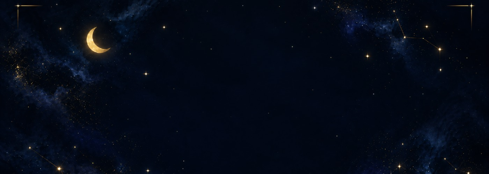
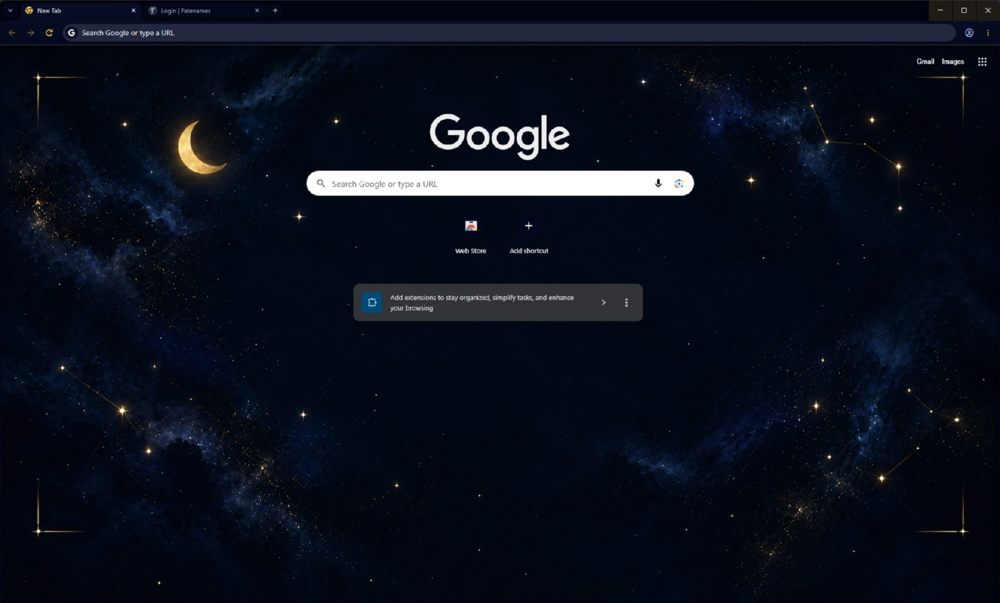
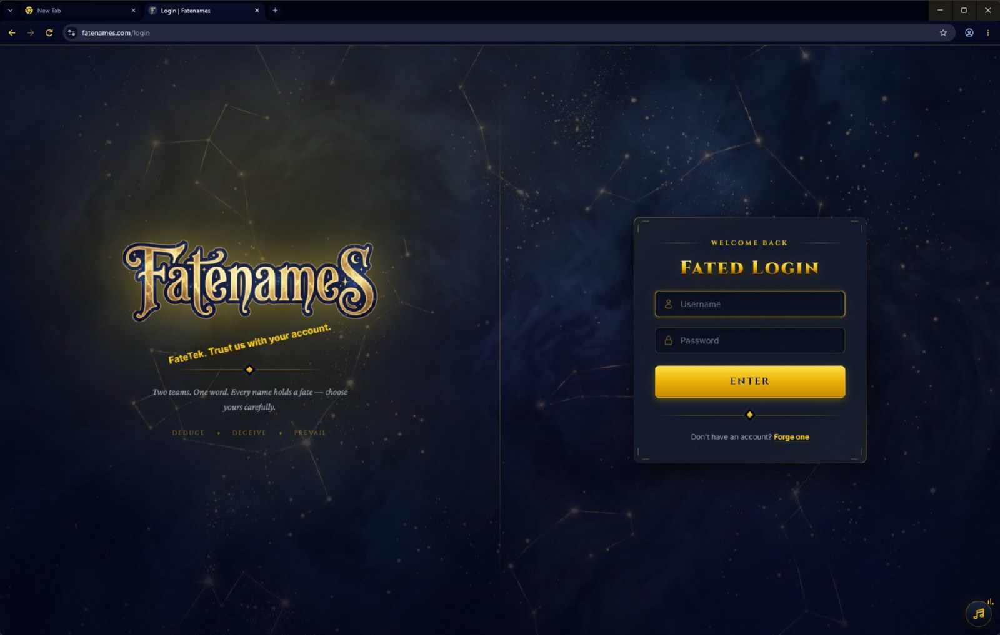

# FATE

A Chrome theme in deep navy and metallic gold. Constellations, nebula, and a gilded crescent, across
every surface of the browser.

## Install

**Chrome Web Store** — listing in review.

**From a release**

1. Download `fate-chrome-theme.zip` from [the latest release](https://github.com/VagueDustin/fate-chrome-theme/releases/latest)
2. Unzip it
3. Open `chrome://extensions` and turn on **Developer mode**
4. Click **Load unpacked** and select the unzipped folder

Chrome only allows one theme at a time. To remove it, go to **Settings → Appearance → Reset to
default**.

Developer mode is needed because Chrome refuses to install a packaged theme from anywhere but the
Web Store. Nothing about the theme requires it.

## What it changes

- Window frame, tab strip and toolbar in deep navy
- Omnibox and bookmarks bar to match
- Toolbar controls — back, forward, reload, menu — in metallic gold
- A painted night sky on the new tab page

Gold is kept for the controls you actually press. Everything else stays quiet, so the browser reads
as still until you reach for it.

The new tab artwork is 1920×1080. Chrome places theme backgrounds at their exact size and never
scales them, so it fills a 1080p new tab edge to edge and sits centred on larger displays against a
matching navy.

## Privacy

No permissions. No background code. No network access. No analytics, no tracking, and no data
collected of any kind. It is a theme and nothing else.

## Design

Navy `#070B1A` and gold `#D4AF37`, the palette shared across every VagueDustin Enterprises product.
Colour comes from the house design tokens rather than being chosen per surface, so gold means
interactive or brand and never anything else.

Navy and gold, inscribed rather than printed, lit from somewhere just off the page.

## Building

Everything here is generated from the brand tokens and the source art by a single script with no
dependencies. See [docs/BUILD.md](docs/BUILD.md).

Provided by VagueDustin Enterprises™
