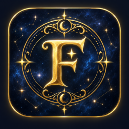
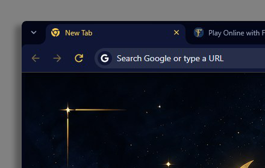

  

<h1 align="center">FATE</h1>

  A Chrome theme in deep navy and metallic gold. 
  Constellations, nebula, and a gilded crescent, across every surface of the browser.

  

## Install

One click, from the [Chrome Web Store](https://chromewebstore.google.com/detail/fate/lghbfnmjlmfdledicaefdejmfmmehdpd).
Works in Chrome, Brave, Edge, and anything else built on Chromium.

Chrome holds one theme at a time. To remove it, go to **Settings → Appearance → Reset to default**.

Prefer to install it by hand? [Download the zip](https://github.com/VagueDustin/fate-chrome-theme/releases/latest/download/fate-chrome-theme.zip),
unzip it, open <code>chrome://extensions</code>, turn on Developer mode, and choose Load
unpacked.

## What it changes

- Window frame, tab strip and toolbar in deep navy
- Omnibox and bookmarks bar to match
- Toolbar controls (back, forward, reload, menu) in metallic gold
- The tab you are on lifted out of the frame, with a gold label
- A painted night sky on the new tab page

The new tab artwork is 1920×1080. Chrome places theme backgrounds at their exact size and never
scales them, so it fills a 1080p new tab edge to edge and sits centred on larger displays against a
matching navy.

## Privacy

No permissions. No background code. No network access. No analytics, no tracking, and no data
collected of any kind. It is a theme and nothing else.

## Design

Navy `#070B1A` and gold `#D4AF37`, the palette shared across every VagueDustin Enterprises product.

Gold is kept for what you can act on: the toolbar controls, links, and the tab you are on. Nothing
decorative uses it, which is what lets it read at a glance against near-black navy.

Navy and gold, inscribed rather than printed, lit from somewhere just off the page.

## Building

Everything here is generated from the brand tokens and the source art by a single script with no
dependencies. See [docs/BUILD.md](docs/BUILD.md).

## Status

FATE is finished. It does what it set out to do and is published on the Chrome Web Store as it is. There's no roadmap for new features, but the source stays here for anyone who wants it.

## License

[MIT](LICENSE). Use it, change it, fork it, ship your own version. No permission needed.

Provided by VagueDustin Enterprises™
